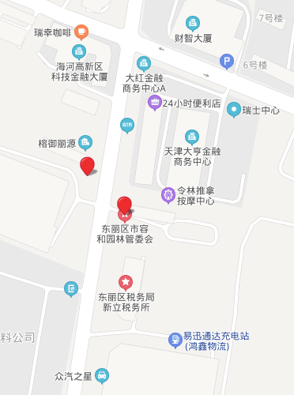
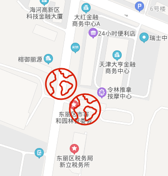

## 标注

### 基础语法

- 添加标注

```html
<!DOCTYPE html>
<html>
  <head>
    <meta name="viewport" content="initial-scale=1.0, user-scalable=no" />
    <meta http-equiv="Content-Type" content="text/html; charset=utf-8" />
    <title>Hello, World</title>
    <style type="text/css">
      html {
        height: 100%;
      }
      body {
        height: 100%;
        margin: 0px;
        padding: 0px;
      }
      #container {
        height: 100%;
      }
    </style>
    <script
      type="text/javascript"
      src="https://api.map.baidu.com/api?v=3.0&ak=您的appkey"
    >
      //v3.0版本的引用方式：src="https://api.map.baidu.com/api?v=3.0&ak=您的密钥"
    </script>
  </head>

  <body>
    <div id="container"></div>
    <script type="text/javascript">
      // 创建地图实例
      var map = new BMap.Map('container');
      // 创建点坐标
      map.centerAndZoom(point, 18);
      //添加点的坐标
      const pointsAll = [
        {
          x: 117.356921,
          y: 39.082631,
        },
        {
          x: 117.357337,
          y: 39.082279,
        },
      ];

      for (let i = 0; i < pointsAll.length; i++) {
        var point = new BMap.Point(pointsAll[i].x, pointsAll[i].y);
        var marker = new BMap.Marker(point); // 创建标注
        map.centerAndZoom(point, 18); //设定缩放级别这句必须有
        map.addOverlay(marker); // 将标注添加到地图中
      }
    </script>
  </body>
</html>
```

- 添加自定义标注点图标

```html
<!DOCTYPE html>
<html>
  <head>
    <meta name="viewport" content="initial-scale=1.0, user-scalable=no" />
    <meta http-equiv="Content-Type" content="text/html; charset=utf-8" />
    <title>Hello, World</title>
    <style type="text/css">
      html {
        height: 100%;
      }
      body {
        height: 100%;
        margin: 0px;
        padding: 0px;
      }
      #container {
        height: 100%;
      }
    </style>
    <script
      type="text/javascript"
      src="https://api.map.baidu.com/api?v=3.0&ak=您的密钥"
    >
      //v3.0版本的引用方式：src="https://api.map.baidu.com/api?v=3.0&ak=您的密钥"
    </script>
  </head>

  <body>
    <div id="container"></div>
    <script type="text/javascript">
      // 创建地图实例
      var map = new BMap.Map('container');
      // 创建点坐标
      map.centerAndZoom(point, 18);
      //添加点的坐标
      const pointsAll = [
        {
          x: 117.356921,
          y: 39.082631,
        },
        {
          x: 117.357337,
          y: 39.082279,
        },
      ];
      //把点加到地图上
      for (let i = 0; i < pointsAll.length; i++) {
        //创建标注图标
        var myIcon = new BMap.Icon(
          './images/worldmap.png',
          new BMap.Size(64, 64), //标记点图片的大小
          { anchor: new BMap.Size(10, 25) } //偏移的位置
        );
        var point = new BMap.Point(pointsAll[i].x, pointsAll[i].y);
        var marker = new BMap.Marker(point, { icon: myIcon }); // 创建标注
        map.centerAndZoom(point, 18); //设定缩放级别这句必须有
        map.addOverlay(marker); // 将标注添加到地图中
      }
      //
    </script>
  </body>
</html>
```

- 标注点跳跃(注意这是 2.0 版本)

```html
<!DOCTYPE html>
<html>
  <head>
    <meta http-equiv="Content-Type" content="text/html; charset=utf-8" />
    <meta name="viewport" content="initial-scale=1.0, user-scalable=no" />
    <style type="text/css">
      body,
      html,
      #allmap {
        width: 100%;
        height: 100%;
        overflow: hidden;
        margin: 0;
        font-family: '微软雅黑';
      }
    </style>
    <script
      type="text/javascript"
      src="//api.map.baidu.com/api?v=2.0&ak=您的密钥"
    ></script>
    <title>添加动画标注点</title>
  </head>
  <body>
    <div id="allmap"></div>
  </body>
</html>
<script type="text/javascript">
  // 百度地图API功能
  var map = new BMap.Map('allmap');
  var point = new BMap.Point(116.404, 39.915);
  map.centerAndZoom(point, 15);
  var marker = new BMap.Marker(point); // 创建标注
  map.addOverlay(marker); // 将标注添加到地图中
  marker.setAnimation(BMAP_ANIMATION_BOUNCE); //跳动的动画
</script>
```




