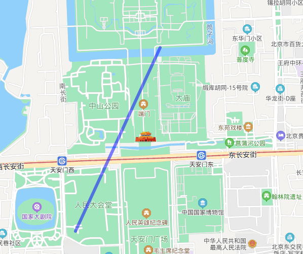

# 标注折线

- 改变折线的颜色

- 改变折线的宽度

## DEMO 画图

```html
<!DOCTYPE html>
<html>
  <head>
    <meta name="viewport" content="initial-scale=1.0, user-scalable=no" />
    <meta http-equiv="Content-Type" content="text/html; charset=utf-8" />
    <title>Hello, World</title>
    <style type="text/css">
      html {
        height: 100%;
      }
      body {
        height: 100%;
        margin: 0px;
        padding: 0px;
      }
      #container {
        height: 100%;
      }
    </style>
    <script
      type="text/javascript"
      src="https://api.map.baidu.com/api?v=3.0&ak=您的密钥"
    >
      //v3.0版本的引用方式：src="https://api.map.baidu.com/api?v=3.0&ak=您的密钥"
    </script>
  </head>

  <body>
    <div id="container"></div>
    <script type="text/javascript">
      // 创建地图实例
      var map = new BMap.Map('container');
      // 创建点坐标
      map.centerAndZoom(new BMap.Point(116.399, 39.91), 18); //以这个点来缩放
      //把点加到地图上
      var polyline = new BMap.Polyline(
        [new BMap.Point(116.399, 39.91), new BMap.Point(116.405, 39.92)],
        { strokeColor: 'blue', strokeWeight: 6, strokeOpacity: 0.5 }
      );
      map.addOverlay(polyline);
      // 初始化地图，设置中心点坐标和地图级别
      map.enableScrollWheelZoom(true);
    </script>
  </body>
</html>
```


