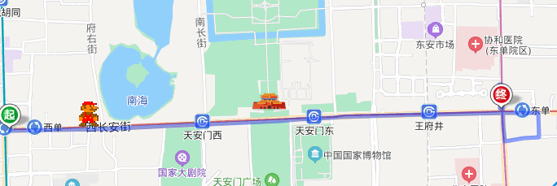

# 单个点运动

## 实现单点运动

```html
<!DOCTYPE html>
<html>
  <head>
    <meta http-equiv="Content-Type" content="text/html; charset=utf-8" />
    <meta name="viewport" content="initial-scale=1.0, user-scalable=no" />
    <style type="text/css">
      body,
      html,
      #allmap {
        width: 100%;
        height: 100%;
        overflow: hidden;
        margin: 0;
        font-family: '微软雅黑';
      }
    </style>
    <script
      type="text/javascript"
      src="//api.map.baidu.com/api?v=2.0&ak=您的密钥"
    ></script>
    <title>单个标注点沿直线的轨迹运动</title>
  </head>
  <body>
    <div id="allmap"></div>
  </body>
</html>
<script type="text/javascript">
  // 百度地图API功能
  var map = new BMap.Map('allmap');
  map.centerAndZoom(new BMap.Point(116.404, 39.915), 15);

  var myP1 = new BMap.Point(116.380967, 39.913285); //起点
  var myP2 = new BMap.Point(116.424374, 39.914668); //终点
  var myIcon = new BMap.Icon('/jsdemo/img/Mario.png', new BMap.Size(32, 70), {
    //小车图片
    //offset: new BMap.Size(0, -5),    //相当于CSS精灵
    imageOffset: new BMap.Size(0, 0), //图片的偏移量。为了是图片底部中心对准坐标点。
  });
  var driving2 = new BMap.DrivingRoute(map, {
    renderOptions: { map: map, autoViewport: true },
  }); //驾车实例
  driving2.search(myP1, myP2); //显示一条公交线路

  window.run = function () {
    var driving = new BMap.DrivingRoute(map); //驾车实例
    driving.search(myP1, myP2);
    driving.setSearchCompleteCallback(function () {
      var pts = driving.getResults().getPlan(0).getRoute(0).getPath(); //通过驾车实例，获得一系列点的数组
      var paths = pts.length; //获得有几个点

      var carMk = new BMap.Marker(pts[0], { icon: myIcon });
      map.addOverlay(carMk);
      i = 0;
      function resetMkPoint(i) {
        carMk.setPosition(pts[i]);
        if (i < paths) {
          setTimeout(function () {
            i++;
            resetMkPoint(i);
          }, 100);
        }
      }
      setTimeout(function () {
        resetMkPoint(5);
      }, 100);
    });
  };

  setTimeout(function () {
    run();
  }, 1500);
</script>
```


