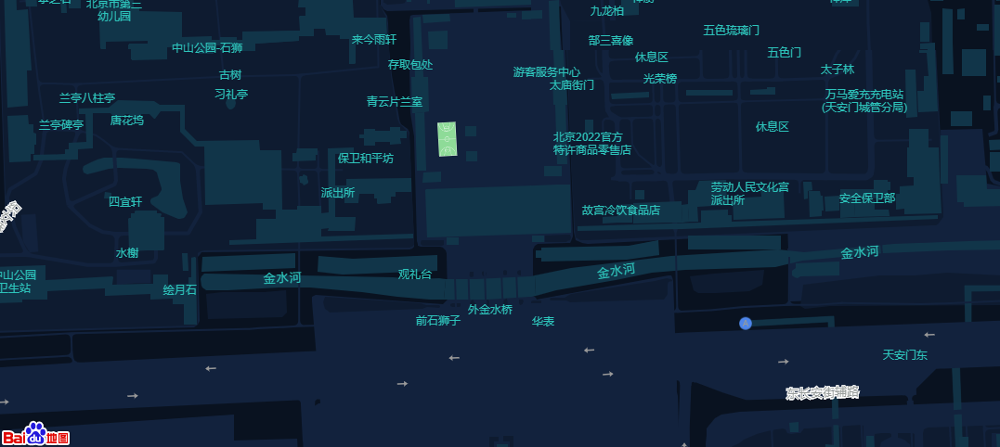

# 个性化地图

有的时候我们不喜欢默认的样式,想换换风格,有两种方式

## 改变主题

```html
<!DOCTYPE html>
<html>
  <head>
    <meta name="viewport" content="initial-scale=1.0, user-scalable=no" />
    <meta http-equiv="Content-Type" content="text/html; charset=utf-8" />
    <title>Hello, World</title>
    <style type="text/css">
      html {
        height: 100%;
      }
      body {
        height: 100%;
        margin: 0px;
        padding: 0px;
      }
      #container {
        height: 100%;
      }
    </style>
    <script
      type="text/javascript"
      src="https://api.map.baidu.com/api?v=3.0&ak=您的密钥"
    >
      //v3.0版本的引用方式：src="https://api.map.baidu.com/api?v=3.0&ak=您的密钥"
    </script>
  </head>

  <body>
    <div id="container"></div>
    <script type="text/javascript">
      var map = new BMap.Map('container');
      // 创建地图实例
      var point = new BMap.Point(116.404, 39.915);
      // 创建点坐标
      map.centerAndZoom(point, 18);
      // 初始化地图，设置中心点坐标和地图级别
      map.enableScrollWheelZoom(true);
      //第一种利用样式ID来设置
      // map.setMapStyleV2({
      //   styleId: '75e84d73cd3ef1169522dd8bb9c4e9dd',
      // });
      //第二种利用JSON文件,去自定义主题网站下载
      var styleJson = [];

      map.setMapStyleV2({
        styleJson: styleJson,
      });
    </script>
  </body>
</html>
```

-- 对应的图片


