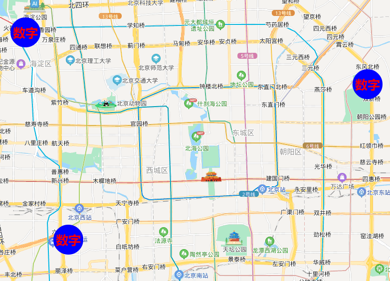

# 添加自定义绘图层

### 添加绘图层

```html
<!DOCTYPE html>
<html>
  <head>
    <meta name="viewport" content="initial-scale=1.0, user-scalable=no" />
    <meta http-equiv="Content-Type" content="text/html; charset=utf-8" />
    <title>Hello, World</title>
    <style type="text/css">
      html {
        height: 100%;
      }
      body {
        height: 100%;
        margin: 0px;
        padding: 0px;
      }
      #container {
        height: 100%;
      }
    </style>
    <script
      type="text/javascript"
      src="https://api.map.baidu.com/api?v=3.0&ak=您的密钥"
    >
      //v3.0版本的引用方式：src="https://api.map.baidu.com/api?v=3.0&ak=您的密钥"
    </script>
  </head>

  <body>
    <div id="container"></div>
    <script type="text/javascript">
      var mp = new BMap.Map('container');
      mp.centerAndZoom(new BMap.Point(116.3964, 39.9093), 13);

      var canvasLayer = new BMap.CanvasLayer({
        update: update,
      });

      function update() {
        var ctx = this.canvas.getContext('2d');

        if (!ctx) {
          return;
        }

        ctx.clearRect(0, 0, ctx.canvas.width, ctx.canvas.height);

        var temp = {};

        var data = [
          new BMap.Point(116.297047, 39.979542),
          new BMap.Point(116.321768, 39.88748),
          new BMap.Point(116.494243, 39.956539),
        ];

        for (var i = 0, len = data.length; i < len; i++) {
          ctx.beginPath();
          // 绘制时需要对经纬度进行转换
          var pixel = mp.pointToPixel(data[i]);
          console.log(pixel);
          //ctx.fillRect(pixel.x, pixel.y, 30, 30);
          ctx.arc(pixel.x, pixel.y, 30, 0, Math.PI * 2, true);
          ctx.fillStyle = 'blue';
          ctx.fill();
          //写文字
          ctx.font = 'bold 25px 微软雅黑';
          ctx.textBaseline = 'left';
          ctx.fillStyle = 'red';
          ctx.fillText('数字', pixel.x - 25, pixel.y + 10, 50); // 开始绘制x,y最大宽度
          ctx.closePath();
        }
      }

      mp.addOverlay(canvasLayer);
    </script>
  </body>
</html>
```


