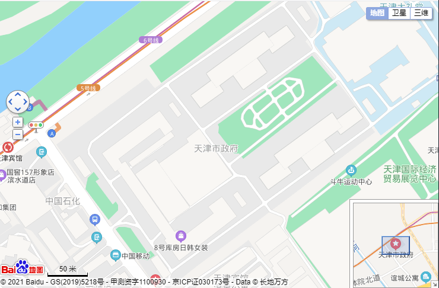

# 添加基础控件

## 添加基础 4 大控件

- 比例尺左下角

- 缩放标记右上角

- 地图切换

- 缩略图是否展开

### 比例尺

```javascript
map.addControl(new BMap.ScaleControl());
```

### 平移缩放

```javascript
map.addControl(new BMap.NavigationControl(opts));
```

### 缩略图右下角

```javascript
const opts_map = {
  isOpen: true, //是否展开
  anchor: BMAP_ANCHOR_BOTTOM_RIGHT, //缩略图位置
};
map.addControl(new BMap.OverviewMapControl(opts_map));
```

### 地图类型

- 可以选择 地图 卫星 三维

```javascript
map.addControl(new BMap.MapTypeControl());
map.setCurrentCity('北京'); // 仅当设置城市信息时，MapTypeControl的切换功能才能可用
```

## 全部汇总

```html
<!DOCTYPE html>
<html>
  <head>
    <meta name="viewport" content="initial-scale=1.0, user-scalable=no" />
    <meta http-equiv="Content-Type" content="text/html; charset=utf-8" />
    <title>Hello, World</title>
    <style type="text/css">
      html {
        height: 100%;
      }
      body {
        height: 100%;
        margin: 0px;
        padding: 0px;
      }
      #container {
        height: 100%;
      }
    </style>
    <script
      type="text/javascript"
      src="https://api.map.baidu.com/api?v=3.0&ak=您的密钥"
    >
      //v3.0版本的引用方式：src="https://api.map.baidu.com/api?v=3.0&ak=您的密钥"
    </script>
  </head>

  <body>
    <div id="container"></div>
    <script type="text/javascript">
      var map = new BMap.Map('container');
      // 创建地图实例
      var point = new BMap.Point(117.208087, 39.091091);
      // 创建点坐标
      map.centerAndZoom(point, 18);
      // 初始化地图，设置中心点坐标和地图级别
      map.enableScrollWheelZoom(true);
      //在本例中我们向地图添加一个平移缩放控件、一个比例尺控件和一个缩略图控件。在地图中添加控件后，它们即刻生效。
      //BMAP_NAVIGATION_CONTROL_LARGE 表示显示完整的平移缩放控件
      //BMAP_NAVIGATION_CONTROL_SMALL 表示显示小型的平移缩放控件
      //BMAP_NAVIGATION_CONTROL_PAN 表示只显示控件的平移部分功能
      //BMAP_NAVIGATION_CONTROL_ZOOM 表示只显示控件的缩放部分功能
      const opts = {
        type: BMAP_NAVIGATION_CONTROL_SMALL, //允许开放的功能
        offset: new BMap.Size(10, 150), //偏移的位置
      };
      //平移缩放功能
      map.addControl(new BMap.NavigationControl(opts));
      //比例尺
      map.addControl(new BMap.ScaleControl());
      //缩略地图
      const opts_map = {
        isOpen: true, //是否展开
        anchor: BMAP_ANCHOR_BOTTOM_RIGHT, //缩略图位置
      };
      map.addControl(new BMap.OverviewMapControl(opts_map));
      //地图类型
      map.addControl(new BMap.MapTypeControl());
      map.setCurrentCity('天津'); // 仅当设置城市信息时，MapTypeControl的切换功能才能可用
    </script>
  </body>
</html>
```

-- 对应的图片


