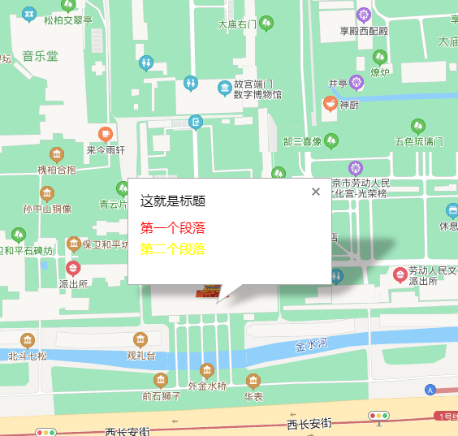

## 信息窗口

### 基础使用

```html
<!DOCTYPE html>
<html>
  <head>
    <meta name="viewport" content="initial-scale=1.0, user-scalable=no" />
    <meta http-equiv="Content-Type" content="text/html; charset=utf-8" />
    <title>Hello, World</title>
    <style type="text/css">
      html {
        height: 100%;
      }
      body {
        height: 100%;
        margin: 0px;
        padding: 0px;
      }
      #container {
        height: 100%;
      }
    </style>
    <script
      type="text/javascript"
      src="https://api.map.baidu.com/api?v=3.0&ak=您的密钥"
    >
      //v3.0版本的引用方式：src="https://api.map.baidu.com/api?v=3.0&ak=您的密钥"
    </script>
  </head>

  <body>
    <div id="container"></div>
    <script type="text/javascript">
      // 创建地图实例
      var map = new BMap.Map('container');
      // 创建点坐标
      var point = new BMap.Point(116.404, 39.915);
      map.centerAndZoom(point, 18);

      var opts = {
        width: 150, //信息窗口宽度
        height: 100, //信息窗口高度
        title: '这就是标题', // 信息窗口标题
      };

      var infoWindow = new BMap.InfoWindow(
        '<div style="padding:0px 0px;"> <p style="color:red;line-height:10px;">第一个段落</p> <p style="color:yellow;line-height:10px;">第二个段落</p> </div>',
        opts
      ); // 创建信息窗口对象
      map.openInfoWindow(infoWindow, map.getCenter()); // 打开信息窗口
    </script>
  </body>
</html>
```


