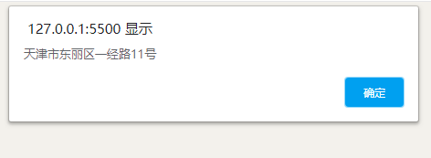

# 逆地址解析

- 逆地址解析就是把现在经纬度变成地址模式

```html
<!DOCTYPE html>
<html>
  <head>
    <meta name="viewport" content="initial-scale=1.0, user-scalable=no" />
    <meta http-equiv="Content-Type" content="text/html; charset=utf-8" />
    <title>Hello, World</title>
    <style type="text/css">
      html {
        height: 100%;
      }
      body {
        height: 100%;
        margin: 0px;
        padding: 0px;
      }
      #container {
        height: 100%;
      }
    </style>
    <script
      type="text/javascript"
      src="//api.map.baidu.com/api?v=3.0&ak=您的密钥"
    ></script>
  </head>

  <body>
    <div id="container"></div>
    <script type="text/javascript">
      // 创建地图实例
      // 百度地图API功能
      var map = new BMap.Map('container');
      map.centerAndZoom(new BMap.Point(117.356921, 39.082631), 11);
      // 创建地理编码实例, 并配置参数获取乡镇级数据
      var myGeo = new BMap.Geocoder({ extensions_town: true });
      // 根据坐标得到地址描述
      myGeo.getLocation(
        new BMap.Point(117.356921, 39.082631),
        function (result) {
          if (result) {
            console.log(result);
            alert(result.address);
          }
        }
      );
    </script>
  </body>
</html>
```


