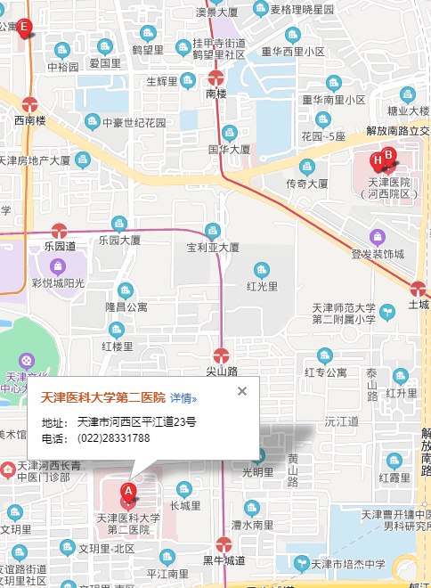

# 检索 POI

- 也就是输入 类似医院 或者学校能把附近的点标记出来

```html
<!DOCTYPE html>
<html>
  <head>
    <meta name="viewport" content="initial-scale=1.0, user-scalable=no" />
    <meta http-equiv="Content-Type" content="text/html; charset=utf-8" />
    <title>Hello, World</title>
    <style type="text/css">
      html {
        height: 100%;
      }
      body {
        height: 100%;
        margin: 0px;
        padding: 0px;
      }
      #container {
        height: 100%;
      }
    </style>
    <script
      type="text/javascript"
      src="//api.map.baidu.com/api?v=3.0&ak=您的密钥"
    ></script>
  </head>

  <body>
    <div id="container"></div>
    <script type="text/javascript">
      // 创建地图实例
      // 百度地图API功能
      var map = new BMap.Map('container', { enableMapClick: false }); //构造底图时，关闭底图可点功能
      var point = new BMap.Point(117.208087, 39.091091); // 创建点坐标
      map.centerAndZoom(point, 16); // 初始化地图,设置中心点坐标和地图级别。
      map.enableScrollWheelZoom(); //启用滚轮放大缩小
      var local = new BMap.LocalSearch(map, {
        renderOptions: { map: map, autoViewport: true },
      });
      local.searchInBounds('医院', map.getBounds());
    </script>
  </body>
</html>
```


